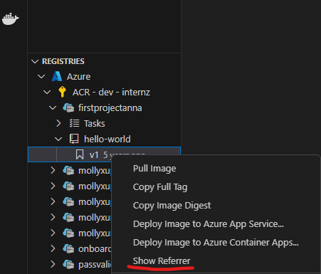
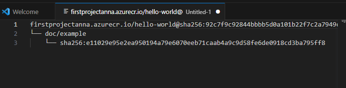
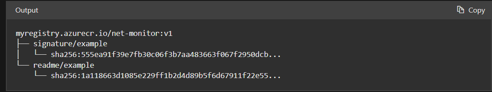

# vscode-securesupplychain
vscode extension for container related secure supply chain tools
## Adding New Capabilities to the Existing Docker VS Code Extension
The expanded extension will create a text document within vscode listing an image's referrers. Accessing the referrers is done through the ORAS CLI.

### User Experience:
#### On right click
Users can access the feature by first navigating to the Registries panel within the Docker View of vscode. 

Then right click on the tag image. Select 'Show Referrer' in the menus option.

The user is logged into the docker cli and the command `oras discover -o tree $IMAGE` is then executed and the referrer output tree is put into a text document to be read by the user.

#### To Do:
 - When an image has no referrers the tree only shows the root image. This is confusing to see as a user and needs to be fixed to instead tell the user no referrers were found for this image.

### Setting up the feature:
- Prerequisites
    - Download ORAS Library
    - Have Docker extension and Docker Desktop installed
    - The directory which contains the oras executable/binary should be added to the user's path environment variable.

### Coding the feature:
-   To implement the image referrer feature, we will replicate the current Docker [commands](https://github.com/microsoft/vscode-docker/tree/main/src/commands) structure for registry items. The coding will follow a clear pattern: defining the command seen in the menu, handling the event triggering, and executing the CLI command. Instead of relying on the Docker CLI, this feature will leverage the ORAS CLI to retrieve image referrers.
    - The ORAS CLI already has a built-in referrer function, which can be invoked using the command: `oras discover -o tree $IMAGE`. When executed, this command generates a graph of artifacts, with the signature and documentation viewed as children of the container image.
    

### Design:
- It will be implemented as a secondary extension dependant on the VScode Docker extension. 
- The secondary extension will activated at the following event: when the user clicks on the "Show Referrers" menus option.
- The referrer list will then be presented as a text document displaying the output of the oras discover command.
- There will need to be added commands to the Docker Extension so that the "Show Referrers" is presented as an option in the menus and so that docker logs the user into their docker cli. This login is important since both docker and oras store credentials in the same config.json file on an individuals operating system, then if docker cli is logged in then so is the oras cli. 

## Known Issues

When a image has no referrers the displayed text doc can be initally confusing to look at.

## Release Notes

Users appreciate release notes as you update your extension.

### 1.0.0

Initial release of ...

### 1.0.1

Fixed issue #.

### 1.1.0

Added features X, Y, and Z.

---

