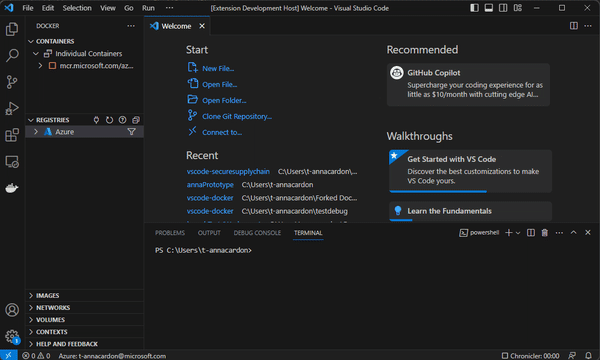
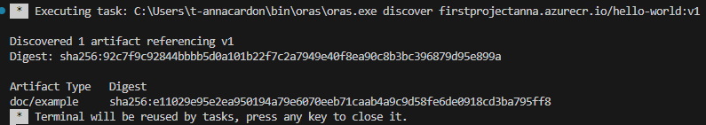

# vscode-securesupplychain
vscode extension for container related secure supply chain tools

## Features

The Show Referrers feature makes it easy to access and view the referrers and artifacts of a image. Although the referrers will appear in the same structure as the output of the command `oras discover OCI_ARTIFACT`.

## Requirements
First run 'npm install' to get necessary libraries.

Be sure to be logged into your Azure container registries and Docker client through terminal.

## Overview of the extension features

### On right click
You can access the feature by first accessing the Registries within the Docker View of vscode. Be sure to be connected to a Registry and navigate to a repository holding the desired image to show referrers. Then right click on the tag image. Select 'Show Referrer' in the menus option.

### Getting referrers from terminal output
The showReferrers command is then activated and a task exectuted in the terminal. Currently the output remains in the terminal but is planned to be set in a text document later on.

## Known Issues

Current feature only shows referrers in the terminal and needs authenication added for a seamless use.

## Release Notes

Users appreciate release notes as you update your extension.

### 1.0.0

Initial release of ...

### 1.0.1

Fixed issue #.

### 1.1.0

Added features X, Y, and Z.

---

## Following extension guidelines

Ensure that you've read through the extensions guidelines and follow the best practices for creating your extension.

* [Extension Guidelines](https://code.visualstudio.com/api/references/extension-guidelines)

## Working with Markdown

You can author your README using Visual Studio Code. Here are some useful editor keyboard shortcuts:

* Split the editor (`Cmd+\` on macOS or `Ctrl+\` on Windows and Linux).
* Toggle preview (`Shift+Cmd+V` on macOS or `Shift+Ctrl+V` on Windows and Linux).
* Press `Ctrl+Space` (Windows, Linux, macOS) to see a list of Markdown snippets.

## For more information

* [Visual Studio Code's Markdown Support](http://code.visualstudio.com/docs/languages/markdown)
* [Markdown Syntax Reference](https://help.github.com/articles/markdown-basics/)

**Enjoy!**

